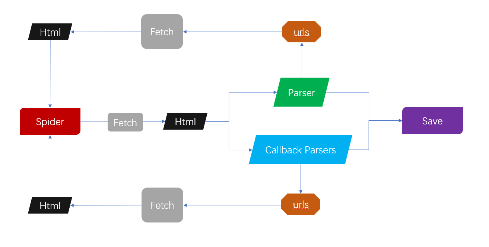

## Written with `asyncio`, `uvloop` and `aiohttp`.

## How to use:
~~~python
import re

from fake_useragent import UserAgent
from jelly import Spider

class MySpider(Spider):
    concurrency = 10
    ua = UserAgent()
    headers = {'User-Agent': ua.random}
    start_url = 'http://quotes.toscrape.com/'

    async def parse(self, response):
        urls = re.findall(r'<a href="(.*?)">\(about\)', response.html)
        self.put_url(urls, callback=self.qoute_parse)

    async def qoute_parse(self, response):
        title = re.search(r'<strong>Description:</strong>', response.html)
        print(title)

if __name__ == '__main__':
    MySpider.run()
~~~
Do not use synchronization code in the parser.

And you always can use `aiomysql`, `aiofiles` or other asynchronous libraries to accomplish data persistence.